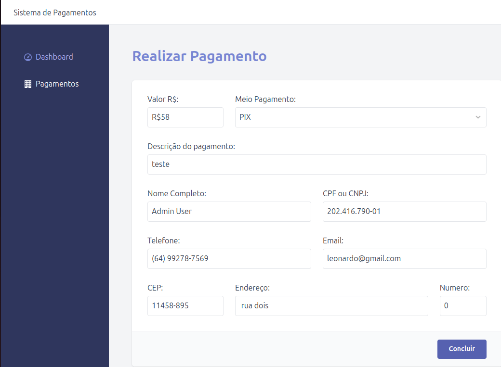

# Sistema de Pagamentos

Uma aplicação simples de demonstração de Laravel + Vite para um sistema de pagamentos de Boleto, Pix e Cartão



## Instalação

Clone o repositório:

Rode o docker:

```sh
docker-compose up -d
```

Entre no container:

```sh
docker exec -it laravel-larapavue-test bash
```

Instale as dependencias do PHP:

```sh
composer install
```

Gere um novo arquivo .env:

```sh
cp .env.example .env
```

Insira seu token de autenticacao da API, na variavel API_TOKEN do arquivo .env 

Gere uma chave da aplicação:

```sh
php artisan key:generate
```

```sh
php artisan config:clear && php artisan view:clear  && php artisan route:clear
```

```sh
php artisan config:cache && php artisan view:cache  && php artisan route:cache
```

Crie as tabelas do banco de dados:

```sh
php artisan migrate
```

Crie o usuário de testes:

```sh
php artisan db:seed
```

Instale as dependencias do layout:

```sh
npm ci
```

Monte o layout:

```sh
npm run build
```

Acesse o sistema pelo navegador:

```sh
http://localhost:8000
```

A aplicação ja deve estar rodando, os dados de login são estes:

- **Username:** admin@example.com
- **Password:** secret

